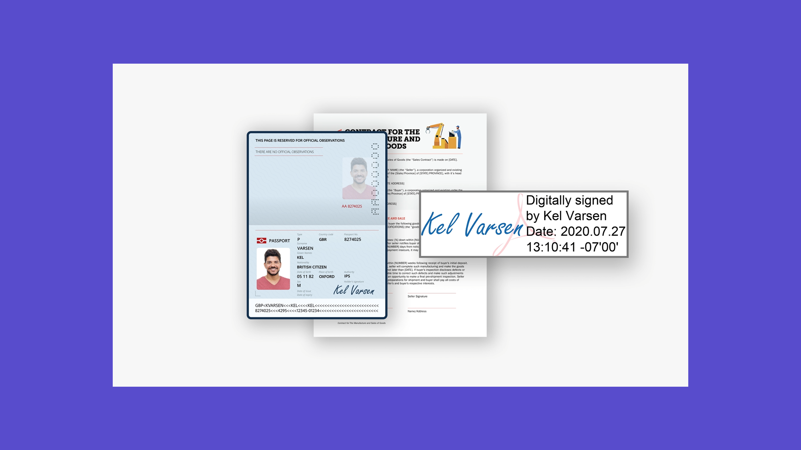

# Visão geral de introdução

Saiba como enviar, assinar e monitorar documentos com estes breves tutoriais passo a passo. Faça um tour rápido pelo Acrobat Sign e comece a enviar um documento para uma ou mais pessoas. Esse conteúdo foi desenvolvido para facilitar os fluxos de trabalho de assinatura eletrônica.

## Novidades

>[!BEGINTABS]

>[!TAB Configurar opções de envio]

Saiba como [configurar várias opções](sending-options.md) ao enviar um documento para assinatura.

>[!TAB Enviar para vários signatários]

Saiba como enviar um documento para assinatura eletrônica a [mais de uma pessoa](send-to-multiple-recipients.md) exatamente na ordem desejada.

>[!TAB Enviar um documento para um signatário único]

Entre e saiba como é fácil [enviar um documento para assinatura](send-to-single-recipient.md).

>[!TAB Introdução ao Acrobat Sign]

É novo no uso do Acrobat Sign? Este [tutorial](new-sender.md) é um ótimo lugar para começar.

>[!ENDTABS]

## Enviar

<table style="table-layout:fixed">
<tr>
  <td>
    
    

    <a href="new-sender.md"><strong>Introdução ao Acrobat Sign</strong></a>
    

    Este tutorial é um ótimo lugar para novos usuários no Acrobat Sign
     
  </td>
 <td>
    
    

    <a href="quick-tour.md"><strong>Noções básicas do espaço de trabalho</strong></a>
    

    Faça um tour rápido pelo espaço de trabalho do Acrobat Sign para começar a usar o produto
     
  </td>
  <td>
    
    

    <a href="send-to-single-recipient.md"><strong>Enviar um documento para um signatário único</strong></a>
    

    Entre e saiba como é fácil enviar um documento para assinatura
     
  </td>
  <td>
    
    

    <a href="send-to-multiple-recipients.md"><strong>Enviar para vários signatários</strong></a>
    

    Envie um documento para assinatura eletrônica a mais de uma pessoa na ordem exata desejada
     
  </td>
</tr>
<tr>
  <td>
    
    

    <a href="sending-options.md"><strong>Configurar opções de envio</strong></a>
    

    Saiba como configurar várias opções ao enviar um documento para assinatura
     
  </td>
  <td>
    
    

    <a href="adding-fields.md"><strong>Adicionando campos aos documentos</strong></a>
    

    Saiba como adicionar diferentes tipos de campos aos documentos
     
  </td>
  <td>
    
    

    <a href="modify-in-flight.md"><strong>Modificando um documento após o envio</strong></a>
    

    Modificar um documento que já está em andamento
     
  </td>
  <td>
    
    

    <a href="replace-signer.md"><strong>Substituindo um signatário</strong></a>
    

    Saiba como alterar o signatário de um documento que já está em andamento
      
  </td>
</tr>
<tr>
  <td>
      
      

      <a href="set-deadlines-reminders.md"><strong>Definir prazos e lembretes</strong></a>
      

      Saiba como enviar lembretes e prazos regulares por email para ajudar a assinar seus documentos rapidamente
       
    </td> 
  <td>
      
      

       
    </td>
    <td>
      
      

       
    </td>
    <td>
      
      

       
    </td>
</tr>
</table>

## Assinar

<table style="table-layout:fixed">
<tr>
  <td>
    
    

    <a href="electronically-sign-a-document.md"><strong>Assinar um documento eletronicamente</strong></a>
    

    Saiba como é fácil assinar um documento enviado para você com o Acrobat Sign
     
  </td>
  <td>
    
    

    <a href="fill-and-sign.md"><strong>Preencher e assinar um documento</strong></a>
    

    Preencha formulários e adicione sua assinatura eletrônica aos documentos
     
  </td>
  <td>
    
    

    <a href="sign-in-person.md"><strong>Obtendo uma assinatura presencialmente</strong></a>
    

    Obtenha a assinatura de outra pessoa usando o aplicativo Acrobat Sign para dispositivos móveis
     
  </td>
  <td>
    
    

    <a href="delegate-signing.md"><strong>Delegar assinatura para outra pessoa</strong></a>
    

    Saiba como delegar a assinatura de um documento a outra pessoa
     
  </td>
</tr>
<tr>
  <td>
    
    

    <a href="sign-with-a-digital-signature.md"><strong>O que é uma assinatura digital</strong></a>
    

    Saiba mais sobre assinaturas digitais com base em certificado
     
  </td>
  <td>
    
    

    <a href="sign-with-a-stamp.md"><strong>Assinatura usando um carimbo</strong></a>
    

    Usar carimbos para marcar um documento aprovado ou concluído
      
  </td> 
 <td>
    
    

     
  </td>
  <td>
    
    

     
  </td>
</tr>  
</table>

## Gerenciar

<table style="table-layout:fixed">
<tr>
  <td>
    
    

    <a href="manage-and-track.md"><strong>Gerenciar e monitorar seus contratos</strong></a>
    

    Saiba como gerenciar e rastrear contratos enviados para assinatura
     
  </td>
  <td>
    
    

    <a href="../sign-advanced-users/create-a-template.md"><strong>Criando um modelo de documento</strong></a>
    

    Crie um modelo de documento reutilizável para fornecer velocidade e consistência à sua organização
     
  </td>
  <td>
    
    

     
  </td>
  <td>
    
    

     
  </td>
</tr>
</table>
