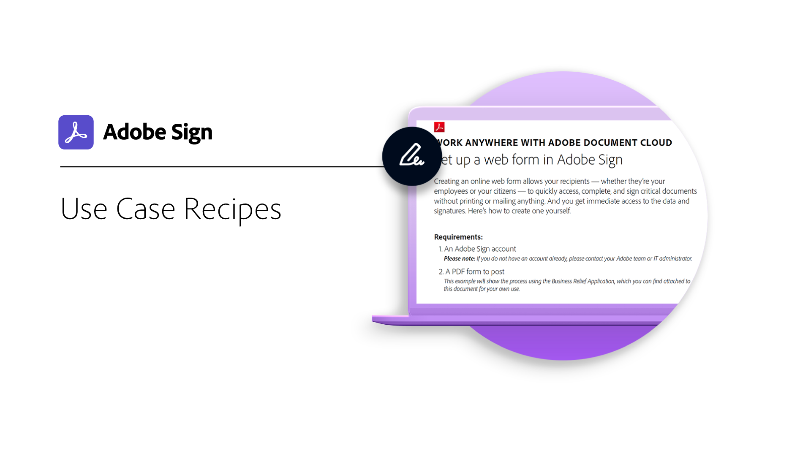

# Visão geral dos setores e departamentos

Saiba como transformar as experiências de assinatura eletrônica da sua organização, explorando casos de uso reais do setor e de departamentos, receitas e webinários.

<table style="table-layout:fixed">
<tr>
  <td>
    
    

    <a href="innovation-series.md"><strong>Skill Builder</strong></a>
    

    <em>Participe para conhecer um Skill Builder de 30 minutos e saber como colocar suas assinaturas eletrônicas em funcionamento, sem precisar adicionar trabalhos extras ao seu dia</em>
     
  </td>
  <td>
    
    

    <a href="recipes.md"><strong>Receitas de caso de uso</strong></a>
    

    <em>Baixe os recursos necessários para implantar rapidamente vários fluxos de trabalho de departamentos de assinatura eletrônica por conta própria</em>
     
  </td>
  <td>
    
    

    <a href="use-case-showcase.md"><strong>Destaque de caso de uso</strong></a>
    

    <em>Assista a sessões ao vivo ou gravadas para conhecer novos casos de uso e tendências do Acrobat Sign</em>
     
  </td>
  <td>
    
    

     
  </td>
</tr>
</table>
