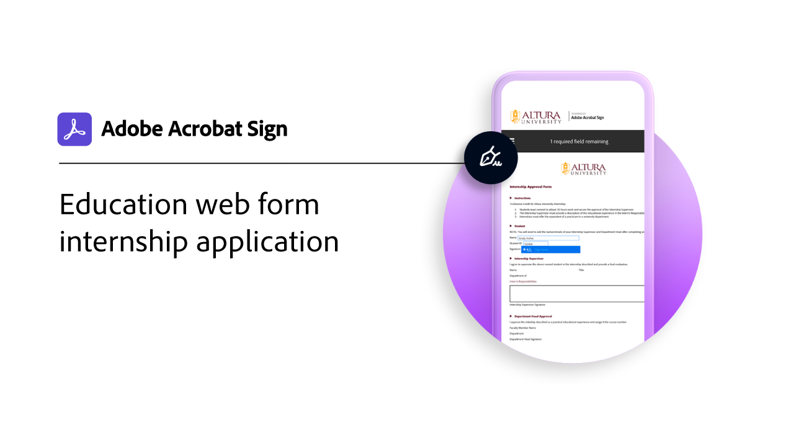

# Receitas de caso de uso

Acelere os fluxos de trabalho digitais da sua organização com estes exemplos de assinaturas eletrônicas para órgãos governamentais e comerciais. Clique para exibir um PDF com recursos e detalhes sobre como configurar esses casos específicos de uso de assinaturas eletrônicas.

## Novidades

* [Aplicativo de estágio do formulário web para instituições de ensino](usecase-edu-intern.md)
Saiba como os formulários Web são usados para melhorar o acesso dos alunos aos formulários necessários
* [Criar um formulário web para instituições de ensino e uma candidatura de estágio](usecase-edu-intern-create.md)
Saiba como criar um formulário web de estágio
* [Solicitação de empréstimo governamental com vários signatários desconhecidos](webform-multiple-signers.md)
Saiba como um formulário web é usado para um fluxo de trabalho complexo de aplicativo de empréstimo governamental que envolve vários participantes desconhecidos

## Casos de uso do governo

<table style="table-layout:fixed">
<tr>
  <td>
    
    

    <a href="webform-multiple-signers.md"><strong>Solicitação de empréstimo governamental com vários signatários desconhecidos</strong></a>
    

    <em>Saiba como um formulário web é usado para um fluxo de trabalho complexo de aplicativo de empréstimo governamental que envolve vários participantes desconhecidos</em>
     
  </td> 
  <td>
    
    

    <a href="usecasegovgrants.md"><strong>Subvenções às empresas e empréstimos</strong></a>
    

    <em>Fornecer assistência rápida às empresas fornecendo acesso de autoatendimento a formulários de solicitação de concessão, empréstimo e diferimento de impostos</em>
     
  </td> 
  <td>
    
    

    <a href="usecasegovtelework.md"><strong>Contrato de trabalho remoto</strong></a>
    

    <em>Colete assinaturas de todos os funcionários com eficiência em contratos de trabalho remoto, atualizações de políticas e muito mais</em>
     
  </td>
  <td>
    
    

    <a href="usecasegovcontracts.md"><strong>Contratos e formulários de requisição</strong></a>
    

    <em>Substitua rapidamente o processamento em papel por fluxos de trabalho digitais em conformidade, complementados com relatórios de auditoria</em>
     
  </td>
</tr>
<tr>
 <td>
    
    

    <a href="usecasegovreemployment.md"><strong>Assistência ao reemprego</strong></a>
    

    <em>Ajude os cidadãos a obter a ajuda de que precisam sem estar alinhados com formulários de candidatura totalmente digitais que podem entrar em operação em dias</em>
     
  </td>
  <td>
    
    

    <a href="usecasegovpaycheck.md"><strong>Proteção de Pagamento</strong></a>
    

    <em>Veja como usar o Acrobat Sign para converter o formulário do Programa de Proteção de Pagamento em um formulário interativo online</em>
     
  </td>
  <td>
    
    

    <a href="usecasegovremote.md"><strong>Solicitação de garantia remota</strong></a>
    

    <em>Use assinaturas eletrônicas e webconferências juntas para reduzir o tempo necessário para solicitar e proteger garantias de juízes</em>
     
  </td>
  <td>
    
    

     
  </td>
</tr>
</table>

## Casos de uso comerciais

<table style="table-layout:fixed">
<tr>
  <td>
    
    

    <a href="usecasecomcontracts.md"><strong>Contratos e formulários de requisição</strong></a>
    

    <em>Substitua rapidamente o processamento em papel por fluxos de trabalho digitais em conformidade, complementados com relatórios de auditoria</em>
     
  </td> 
  <td>
    
    

    <a href="usecasecompolicy.md"><strong>Contratos de política</strong></a>
    

    <em>Colete assinaturas de todos os funcionários com eficiência em contratos de política e atualizações</em>
     
  </td>
  <td>
    
    

    <a href="usecasecomtelework.md"><strong>Contrato de trabalho remoto</strong></a>
    

    <em>Colete assinaturas de todos os seus funcionários em contratos de trabalho remoto com eficiência</em>
     
  </td>
  <td>
    
    

     
  </td>
</tr>
</table>

## Casos de uso para instituições de ensino

<table style="table-layout:fixed">
<tr>
  <td>
    
    

    <a href="usecase-edu-intern.md"><strong>Aplicativo de estágio do formulário web para instituições de ensino</strong></a>
    

    <em>Saiba como os formulários Web são usados para melhorar o acesso dos alunos aos formulários necessários</em>
     
  </td> 
  <td>
    
    

    <a href="usecase-edu-intern-create.md"><strong>Criar um formulário web para instituições de ensino e uma candidatura de estágio</strong></a>
    

    <em>Saiba como criar um formulário web de estágio</em>
     
  </td> 
  <td>
    
    

     
  </td>
  <td>
    
    

     
  </td>
</tr>
</table>

