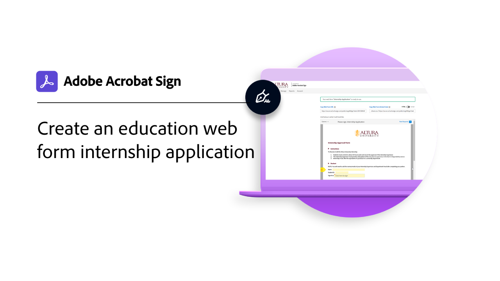

# Casos de uso

Explore como várias organizações estão usando o Acrobat Sign para transformar os fluxos de trabalho digitais da organização com esses casos de uso reais.

## Novidades

>[!BEGINTABS]

>[!TAB Fluxo de trabalho personalizado para processo IEP educacional]

Saiba como o [Designer de Fluxo de Trabalho Personalizado](usecase-edu-iep.md) é usado para digitalizar um processo do Programa de Educação Individualizado (IEP).

>[!TAB Solicitação de estágio de formulário da Web para instituições de ensino]

Saiba como os [formulários web](usecase-edu-intern.md) são usados para melhorar o acesso dos alunos aos formulários necessários.

>[!TAB Criar um aplicativo de estágio de formulário educacional na Web]

Saiba como criar um [formulário da Web](usecase-edu-intern-create.md) de estágio.

>[!TAB Aplicativo de empréstimo governamental com vários signatários desconhecidos]

Saiba como um [formulário da Web](webform-multiple-signers.md) é usado para um fluxo de trabalho complexo de aplicativo de empréstimo do governo que envolve vários participantes desconhecidos.

>[!ENDTABS]

## Casos de uso do governo

<table style="table-layout:fixed">
<tr>
  <td>
    
    

    <a href="webform-multiple-signers.md"><strong>Aplicativo de empréstimo governamental com vários signatários desconhecidos</strong></a>
    

    <em>Saiba como um formulário da Web é usado para um fluxo de trabalho complexo de aplicativo de empréstimo governamental que envolve vários participantes desconhecidos</em>
     
  </td> 
  <td>
    
    

    <a href="usecasegovgrants.md"><strong>Concessões e empréstimos comerciais</strong></a>
    

    <em>Forneça assistência rápida às empresas fornecendo acesso de autoatendimento a formulários de solicitação de concessão, empréstimo e diferimento de impostos</em>
     
  </td> 
  <td>
    
    

    <a href="usecasegovtelework.md"><strong>Contrato de trabalho à distância</strong></a>
    

    <em>Colete assinaturas de todos os seus funcionários com eficiência em contratos de teletrabalho, atualizações de política e muito mais</em>
     
  </td>
  <td>
    
    

    <a href="usecasegovcontracts.md"><strong>Contratos e formulários de requisição</strong></a>
    

    <em>Substitua rapidamente o processamento de papel por fluxos de trabalho digitais compatíveis, com relatórios de auditoria</em>
     
  </td>
</tr>
<tr>
 <td>
    
    

    <a href="usecasegovreemployment.md"><strong>Assistência para Reemprego</strong></a>
    

    <em>Ajude os cidadãos a obter a ajuda de que precisam sem ficar alinhados com os formulários de aplicativos digitais que podem ser disponibilizados em dias</em>
     
  </td>
  <td>
    
    

    <a href="usecasegovpaycheck.md"><strong>Proteção Contra Cheque De Pagamento</strong></a>
    

    <em>Veja como usar o Acrobat Sign para converter o formulário do Programa de Proteção de Pagamento em um formulário interativo online</em>
     
  </td>
  <td>
    
    

    <a href="usecasegovremote.md"><strong>Solicitação de garantia remota</strong></a>
    

    <em>Use assinaturas eletrônicas e webconferências juntas para reduzir o tempo necessário para solicitar e proteger mandados de juízes</em>
     
  </td>
  <td>
    
    

     
  </td>
</tr>
</table>

## Casos de uso comercial

<table style="table-layout:fixed">
<tr>
  <td>
    
    

    <a href="usecasecomcontracts.md"><strong>Contratos e formulários de requisição</strong></a>
    

    <em>Substitua rapidamente o processamento de papel por fluxos de trabalho digitais compatíveis, com relatórios de auditoria</em>
     
  </td> 
  <td>
    
    

    <a href="usecasecompolicy.md"><strong>Contratos de política</strong></a>
    

    <em>Colete assinaturas de todos os seus funcionários com eficiência em contratos de política e atualizações</em>
     
  </td>
  <td>
    
    

    <a href="usecasecomtelework.md"><strong>Contrato de trabalho à distância</strong></a>
    

    <em>Colete assinaturas de todos os seus funcionários com eficiência em contratos de teletrabalho</em>
     
  </td>
  <td>
    
    

     
  </td>
</tr>
</table>

## Casos de uso educacionais

<table style="table-layout:fixed">
<tr>
  <td>
    
    

    <a href="usecase-edu-intern.md"><strong>Solicitação de estágio de formulário da Web para instituições de ensino</strong></a>
    

    <em>Saiba como os formulários web são usados para melhorar o acesso dos alunos aos formulários necessários</em>
     
  </td> 
  <td>
    
    

    <a href="usecase-edu-intern-create.md"><strong>Criar um aplicativo de estágio de formulário educacional na Web</strong></a>
    

    <em>Saiba como criar um formulário da Web de estágio</em>
     
  </td> 
  <td>
    
    

    <a href="usecase-edu-iep.md"><strong>Fluxo de trabalho personalizado para processo IEP educacional</strong></a>
    

    <em>Saiba como o Designer de Fluxo de Trabalho Personalizado é usado para digitalizar um processo do Programa de Educação Individualizado (IEP)</em>
     
  </td>
  <td>
    
    

     
  </td>
</tr>
</table>

